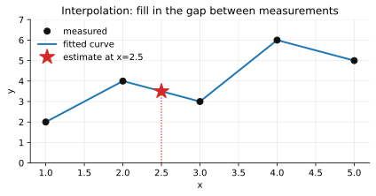
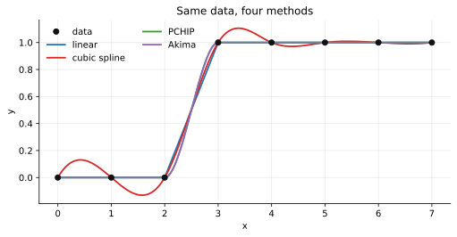
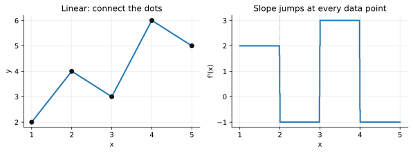
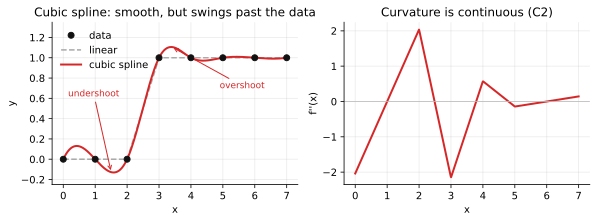
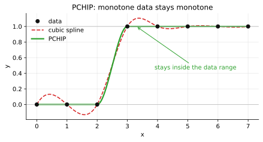
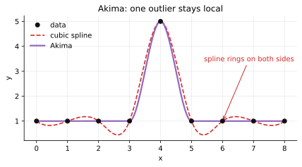
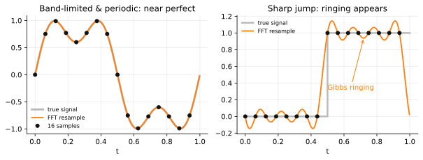

# Interpolation❓

[**🧮 Try the calculator**](https://ryuora144.duckdns.org/interpolate_cal) [**📐 Linear interpolation**](https://ryuora144.duckdns.org/interpolate_blog) [**🏠 Home**](https://ryuora144.duckdns.org/)

## What is Interpolation

Suppose you have measured data

$$
(x_1,y_1),\ (x_2,y_2),\ \dots,\ (x_n,y_n)
$$

but you want to estimate $y$ at an $x$ where you did not measure it.

For example:

```
measured:
x = 1   2   3   4   5
y = 2   4   3   6   5

want:
x = 2.5
```

An interpolation method constructs a function $\hat y = f(x)$ that passes through, or is otherwise constrained by, the known data points.



**The one-sentence version:** you have dots, you need a curve through them, and every method below is just a different opinion about what should happen *between* the dots.

## Methods

How do we construct the curve between the known points? We can implement this idea as a real algorithm via the SciPy library in Python.

There are 5 major categories: linear, cubic spline, monotone cubic/PCHIP, Akima, and FFT-based.



Same dots, four curves. The whole rest of this post is about why they disagree.

## Linear (1D) interpolation

**In plain words.** Draw a straight line from each dot to the next one. To find $y$ at some $x$, look up which two dots you are between and slide along that line.

**Basic idea.** Take two neighboring data points and connect them with a straight line. For two points $(x_0,y_0)$ and $(x_1,y_1)$ the interpolation is

$$
y(x) = y_0 + \frac{y_1-y_0}{x_1-x_0}\,(x-x_0)
$$



**Important characteristic.** The curve itself is continuous, $C^0$, but its slope usually changes abruptly at every data point, so $f'(x)$ is generally discontinuous. That is why a linear plot looks jagged even though the curve technically has no gaps.

Look at the right panel above: the curve has no gaps, but the slope is a staircase. Every step in that staircase is a corner you can see in the left panel.

Advantages

* Very simple
* Very stable
* No overshoot
* Doesn't create artificial oscillations
* Good when the data itself may contain abrupt changes
* Very fast

Disadvantages

* Not smooth
* Derivative jumps at every point
* Poor visual representation of a naturally smooth physical process

## Cubic spline interpolation

**In plain words.** Instead of a straight line per gap, use a gentle S-shaped curve per gap, and glue them together so the joins are invisible: same height, same slope, same bend on both sides of every dot. The price of that smoothness is that the curve is allowed to bulge past the dots.

**Basic idea.** Fit a separate cubic polynomial on every interval, then force neighboring cubics to agree in value, first derivative, and second derivative at each shared point. On the interval between $(x_i,y_i)$ and $(x_{i+1},y_{i+1})$ the local piece is

$$
S_i(x) = a_i + b_i(x-x_i) + c_i(x-x_i)^2 + d_i(x-x_i)^3
$$

and the coefficients are solved as one global system so that

$$
S_i(x_{i+1}) = S_{i+1}(x_{i+1}),\qquad
S_i'(x_{i+1}) = S_{i+1}'(x_{i+1}),\qquad
S_i''(x_{i+1}) = S_{i+1}''(x_{i+1})
$$

holds at every interior knot. Boundary conditions (natural, clamped, or not-a-knot) close the remaining degrees of freedom.



**Important characteristic.** The curve is smooth up to the second derivative, $C^2$, so both slope and curvature are continuous across data points. That is what makes cubic splines look physically natural compared to the linear case, but the same freedom lets the curve swing past the data between points. $f''(x)$ is continuous, yet the fitted curve can overshoot or undershoot near sharp changes.

The data above only ever takes the values 0 and 1, yet the spline dips below 0 and rises above 1. If $y$ is a concentration, a probability, or a count, that curve is now telling you something physically impossible.

Advantages

* Very smooth ($C^2$)
* Visually matches naturally smooth physical processes
* Widely used default, well studied
* Closed-form, fast to evaluate once solved

Disadvantages

* Can overshoot between points, especially near sharp jumps
* Not guaranteed to preserve monotonicity of the data
* Global solve: one bad point can distort the whole curve
* Sensitive to boundary condition choice

## Monotone cubic / PCHIP interpolation

**In plain words.** Same S-shaped pieces as a spline, but with a rule added: if the data only goes up, the curve is not allowed to come back down. Whenever the spline would have bulged past a data point, PCHIP flattens the slope just enough to prevent it.

**Basic idea.** Keep the piecewise-cubic structure, but instead of solving a global system for the derivatives, estimate each derivative $m_i$ locally from the slopes of neighboring segments, then clip that estimate so the interpolant never overshoots. The Fritsch–Carlson conditions choose $m_i$ so that if

$$
y_{i-1} \le y_i \le y_{i+1}
$$

on both adjacent segments, the interpolated curve is also non-decreasing between $x_i$ and $x_{i+1}$. SciPy's PCHIP (Piecewise Cubic Hermite Interpolating Polynomial) is the standard implementation of this idea.



**Important characteristic.** The curve is smooth in its first derivative but not necessarily in its second: $C^1$, so slope is continuous but curvature can kink at the knots. This is a deliberate trade-off — PCHIP gives up $C^2$ smoothness in exchange for guaranteed shape preservation. Unlike the plain cubic spline, the interpolant is guaranteed monotone wherever the data is monotone.

Same data as the spline figure. The dashed red curve leaves the $[0,1]$ band; the green one never does.

Advantages

* No overshoot
* Preserves monotonicity of the original data
* Local computation: a change in one point doesn't ripple through the whole curve
* Good for data that should not wiggle (cumulative distributions, sensor readings)

Disadvantages

* Only $C^1$, less smooth than a full cubic spline
* Slightly more conservative-looking curve than a spline
* Derivative estimates are heuristic, not derived from a global optimality condition

## Akima interpolation

**In plain words.** When deciding the slope at a dot, look at its neighbors and trust the side that looks calmer. If one neighbor is a wild jump and the other is flat, lean toward the flat one. A single weird data point then disturbs only its immediate surroundings instead of setting off ripples across the whole curve.

**Basic idea.** Like PCHIP, Akima builds a piecewise cubic from locally estimated derivatives rather than a global solve, but it estimates each slope as a weighted average of the two neighboring secant slopes, weighted by how much the slopes themselves differ:

$$
t_i = \frac{|m_{i+1}-m_i|\,m_{i-1} + |m_{i-1}-m_{i-2}|\,m_i}
           {|m_{i+1}-m_i| + |m_{i-1}-m_{i-2}|}
$$

where each $m_k$ is the secant slope of segment $k$. When neighboring slopes are consistent this behaves like a smooth spline; when they diverge sharply, the weighting favors the segment whose neighborhood is more stable, which suppresses overshoot.



**Important characteristic.** The curve is $C^1$ continuous, similar to PCHIP, but Akima's weighting makes it less prone to the wide, sweeping overshoots that cubic splines produce near outliers, without imposing PCHIP's strict monotonicity constraint. The curve tends to hug the data more tightly than a standard cubic spline even where the data changes rapidly.

The figure has one spike in otherwise flat data. The spline reacts by oscillating for several points on either side. Akima treats the spike as a local event and returns to flat immediately.

Advantages

* Less overshoot than cubic spline
* Less sensitive to outliers and rapid local changes than cubic spline
* Locally computed, like PCHIP
* Good middle ground between spline smoothness and PCHIP's rigidity

Disadvantages

* Only $C^1$, not as smooth as a full cubic spline
* Does not guarantee monotonicity (unlike PCHIP)
* Slightly more complex to reason about than linear or PCHIP
* The original formulation divides by zero when neighboring slopes are exactly equal, though SciPy handles this edge case

## FFT (spectral) interpolation

**In plain words.** Forget curves between neighbors. Assume the samples are one full loop of a repeating wave, break that wave into pure sine waves, then redraw those same sine waves on a finer grid. If the signal really is a smooth repeating wave, this is nearly exact. If it has a sharp edge, sine waves cannot make a sharp edge, and you get ripples.

**Basic idea.** Assume the sampled sequence is one period of a periodic, band-limited signal. For $N$ uniformly spaced samples the forward transform is

$$
X_k = \sum_{n=0}^{N-1} x_n\, e^{-2\pi i kn/N}
$$

The spectrum is zero-padded from $N$ to $M > N$ coefficients (zeros inserted at the high frequencies, the Nyquist term split), and the inverse transform gives the resampled sequence

$$
y_m = \frac{M}{N}\cdot\frac{1}{M}\sum_{k=0}^{M-1}\tilde X_k\, e^{2\pi i km/M}
$$

This is exactly Whittaker–Shannon sinc interpolation, wrapped periodically. SciPy exposes it as `scipy.signal.resample`.



**Important characteristic.** The interpolant is a trigonometric polynomial, so it is infinitely differentiable, $C^\infty$ — every derivative is continuous everywhere, stronger than anything the piecewise methods offer. But the method is fully global: each output sample depends on all $N$ inputs, and the reconstruction assumes $x(t+T) = x(t)$. If the data does not actually wrap around, that mismatch reads as a discontinuity and produces Gibbs ringing near both ends. Perfect smoothness, but the error is spread everywhere rather than confined to one interval.

Left panel: 16 samples of a two-tone signal reconstructed almost perfectly. Right panel: the same method on a step, where the ripples never fully die out no matter how many samples you add.

Advantages

* Infinitely smooth ($C^\infty$)
* Exact reconstruction for band-limited periodic signals
* Spectrally accurate: error decays faster than any polynomial rate for smooth periodic data
* $O(N\log N)$, efficient for large uniform datasets
* Natural choice when the analysis is already happening in the frequency domain

Disadvantages

* Requires uniformly spaced samples (no irregular $x$ grids)
* Assumes periodicity; non-periodic data causes edge artifacts
* Gibbs ringing near jumps or sharp features
* Fully global: one bad sample contaminates the entire output
* Resamples onto a whole new grid rather than evaluating at a single arbitrary $x$

## Which one should you pick

| If your data is... | use |
| --- | --- |
| noisy, or you need a guaranteed safe answer | linear |
| a smooth physical measurement, no hard bounds | cubic spline |
| monotone, bounded, or physically constrained | PCHIP |
| mostly smooth but with occasional outliers | Akima |
| uniformly sampled, periodic, band-limited | FFT resample |

None of these is more correct than the others. They are bets about what happens where you have no data, and the failure modes are more useful than the feature lists. Linear fails by looking jagged. Splines fail by inventing values that don't exist. PCHIP fails by being slightly stiff. Akima fails by being harder to explain. FFT fails by ringing everywhere at once. Pick the failure you can live with.

## REFs

[Scipy Interpolation](https://docs.scipy.org/doc/scipy/tutorial/interpolate.html)
[Scipy Linear Interpolation](https://docs.scipy.org/doc/scipy/tutorial/interpolate/1D.html)
[Scipy CubicSpline](https://docs.scipy.org/doc/scipy/reference/generated/scipy.interpolate.CubicSpline.html)
[Scipy PchipInterpolator](https://docs.scipy.org/doc/scipy/reference/generated/scipy.interpolate.PchipInterpolator.html)
[Scipy Akima1DInterpolator](https://docs.scipy.org/doc/scipy/reference/generated/scipy.interpolate.Akima1DInterpolator.html)
[Fritsch & Carlson (1980), "Monotone Piecewise Cubic Interpolation"](https://epubs.siam.org/doi/10.1137/0717021)
[Akima (1970), "A New Method of Interpolation and Smooth Curve Fitting Based on Local Procedures"](https://dl.acm.org/doi/10.1145/321607.321609)
[Scipy signal.resample (FFT-based resampling)](https://docs.scipy.org/doc/scipy/reference/generated/scipy.signal.resample.html)
[Scipy signal.resample_poly (polyphase alternative)](https://docs.scipy.org/doc/scipy/reference/generated/scipy.signal.resample_poly.html)
[Scipy FFT module](https://docs.scipy.org/doc/scipy/tutorial/fft.html)
[Shannon (1949), "Communication in the Presence of Noise" (sampling theorem)](https://ieeexplore.ieee.org/document/1697831)
